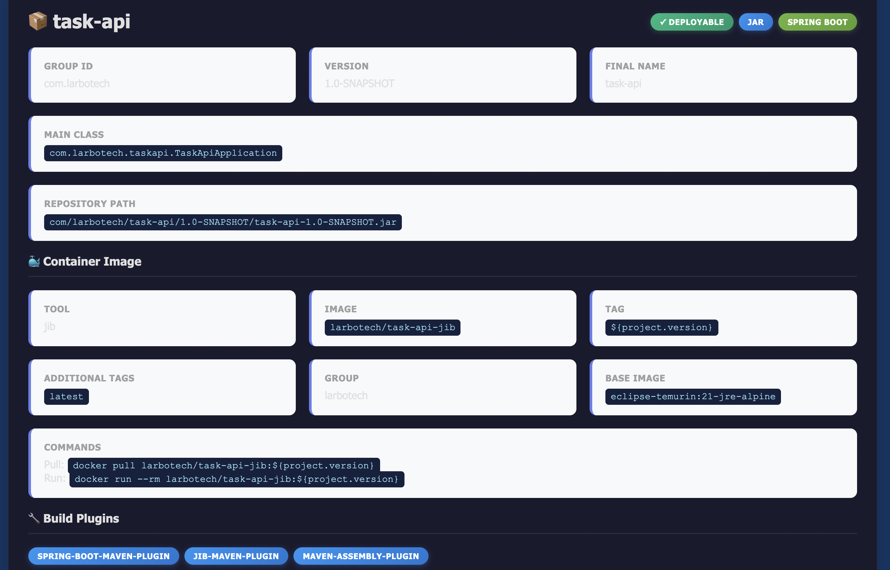
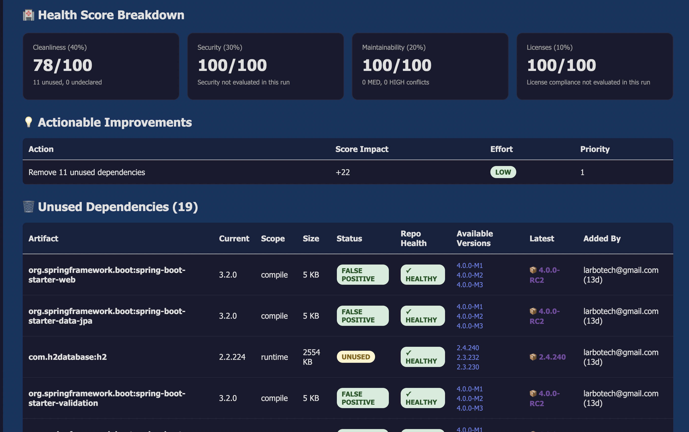
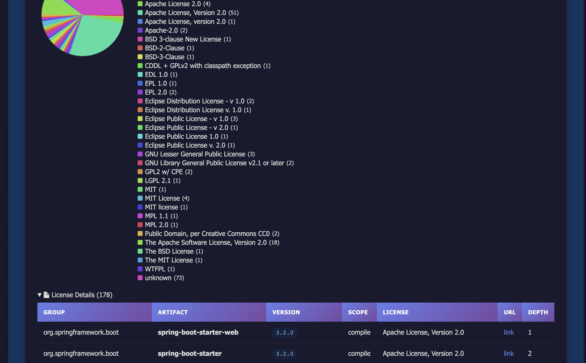
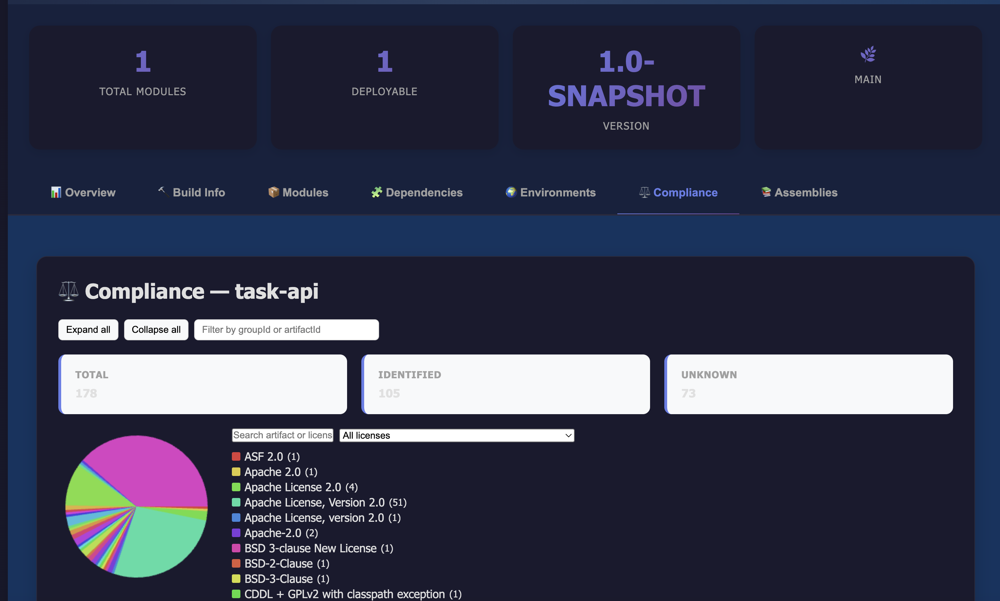

# Maven Deploy Manifest Plugin

[](https://central.sonatype.com/artifact/io.github.tourem/deploy-manifest-plugin)
[](https://opensource.org/licenses/Apache-2.0)
[](https://openjdk.org/)

> **Know exactly what's running in production—automatically.**


> 📚 Documentation:
> - English: [Full Documentation](./doc-en.md)
> - Français: [Documentation complète](./doc.md)


## Table of Contents
- [Why This Plugin?](#why-this-plugin)
- [What You Get in 30 Seconds](#what-you-get-in-30-seconds)
- [Key Features That Save You Time](#key-features-that-save-you-time)
- [Perfect For](#perfect-for)
- [Try It Now (No Installation Required)](#try-it-now-no-installation-required)
- [See It In Action](#see-it-in-action)
  - [🎥 Video Demonstrations](#-video-demonstrations)
- [Real-World Example](#real-world-example)
- [What Makes It Different?](#what-makes-it-different)
- [Who's Using It?](#whos-using-it)
- [Quick Start](#quick-start)
- [Usage (quick)](#usage-quick)
- [Example JSON output](#example-json-output)
- [Configuration Parameters](#configuration-parameters)
- [Requirements](#requirements)
- [Building from Source](#building-from-source)
- [What Gets Detected (high level)](#what-gets-detected-high-level)
- [Troubleshooting](#troubleshooting)
- [License](#license)

## Why This Plugin?

Ever deployed to production and wondered:
- Which exact dependencies are in this JAR?
- What Docker image was deployed and from which commit?
- Which Spring Boot profiles are active in each environment?

**Stop guessing. Start knowing.**

This plugin generates a comprehensive deployment descriptor with commit SHA, container images, dependencies, and environment configs in a single JSON/YAML/HTML file.

**Published on Maven Central:** `io.github.tourem:deploy-manifest-plugin`

---

## What You Get in 30 Seconds

```bash
# One command, complete traceability
mvn io.github.tourem:deploy-manifest-plugin:2.6.0:generate
```

Generates `descriptor.json` with project/build/git metadata and module insights.
See "Example JSON output" below for a concise sample.

---

## Key Features That Save You Time

| Feature | What It Does | Why You Care |
|---|---|---|
| Auto-detection | Scans modules, frameworks, env configs | Zero manual setup |
| Full traceability | Git commit/branch, CI metadata | Debug prod issues fast |
| Docker aware | Detects Jib, Spring Boot build-image, Fabric8, Quarkus, Micronaut, JKube | Know what's containerized |
| Dependency tree (opt) | Flat/Tree, collapsible tree with highlight + Prev/Next, quick filters, CSV, duplicates, scope badges | Understand your runtime |
| **Dependency analysis** | **Smart unused/undeclared detection with false positive filtering** | **Clean dependencies 80% faster** |
| **Repository health (NEW v2.6.0)** | **Checks dependency health: last release, contributors, GitHub metrics** | **Avoid abandoned dependencies** |
| **Available versions (NEW v2.6.0)** | **Shows 3 newer versions + latest for each dependency** | **Stay up-to-date easily** |
| **Plugin analysis (NEW v2.6.0)** | **Tracks Maven plugins with outdated detection** | **Keep build tools current** |
| Multiple formats | JSON, YAML, HTML report | Share with all stakeholders |

## Perfect For

- DevOps teams: know what's deployed without SSH
- Security audits: track every dependency and version
- Incident response: identify what changed between releases
- Compliance: generate deployment docs automatically
- Multi-module projects: see the full picture

## Try It Now (No Installation Required)

```bash
# Single module or multi-module (run at root)
mvn io.github.tourem:deploy-manifest-plugin:2.6.0:generate

# With HTML report
mvn io.github.tourem:deploy-manifest-plugin:2.6.0:generate -Ddescriptor.generateHtml=true
```

---

## See It In Action

### Descriptor HTML Dashboard
- JSON: see the "Example JSON output" section below
- HTML report includes: interactive dashboard, Dependencies tab per module with collapsible tree (highlight + Prev/Next, quick filters, scope badges), environment configs, CSV export
- Screenshots:
  - 
  - 

### Dependency Analysis HTML Dashboard (NEW v2.6.0)
- Smart dependency analysis with unused/undeclared detection and false positive filtering
- Repository health checking with GitHub metrics (contributors, stars, last release date)
- Available versions display (3 newer versions + latest) for easy upgrade planning
- Maven plugins analysis with outdated detection
- Screenshots:
  - 
  - 

### 🎥 Video Demonstrations

Watch complete walkthroughs showcasing all features in action:

<table>
<tr>
<td width="50%" align="center">

**🇫🇷 Démonstration en Français**

[](https://youtu.be/CLNUvOquHas)

[▶️ Regarder sur YouTube](https://youtu.be/CLNUvOquHas)

</td>
<td width="50%" align="center">

**🇬🇧 English Demonstration**

[](https://youtu.be/4CWSKUi2Ys4)

[▶️ Watch on YouTube](https://youtu.be/4CWSKUi2Ys4)

</td>
</tr>
</table>

---

## Real-World Example

Before deployment:
```bash
mvn clean package
mvn io.github.tourem:deploy-manifest-plugin:2.6.0:generate
cat target/descriptor.json  # verify
mvn deploy
```

In production (incident happens):
```bash
# Download descriptor from your artifact repository
curl https://repo.example.com/.../descriptor.json

# Instantly see:
# - Git commit SHA → check exact code
# - Docker image tag → verify container
# - Spring profiles → confirm configuration
# - Dependencies → spot version conflicts
```

---

## What Makes It Different?

| Other Tools | Maven Deploy Manifest Plugin |
|-------------|-----------------------------|
| Manual configuration required | Zero-config auto-detection |
| Only captures basic info | Complete deployment picture |
| Separate tools for Docker, Git, Spring Boot | All-in-one solution |
| Complex setup | One command, done |
| Static output | JSON/YAML/HTML + webhooks |

---

## 🆕 Dependency Analysis: Maven Dependency Plugin on Steroids

**New Goal**: `analyze-dependencies` — Transform raw dependency warnings into actionable insights.

### Why Not Just Use `mvn dependency:analyze`?

| Feature | `mvn dependency:analyze` | `deploy-manifest-plugin:analyze-dependencies` |
|---------|-------------------------|----------------------------------------------|
| **Detection** | ✅ Finds unused/undeclared | ✅ Same detection (Maven Dependency Analyzer) |
| **False Positives** | ❌ 60% noise (Spring Boot Starters, Lombok, etc.) | ✅ Auto-detected & filtered (-55% noise) |
| **Context** | ❌ No context | ✅ Git blame (who added, when, commit) |
| **Recommendations** | ❌ None | ✅ Ready POM patches + verify/rollback commands |
| **Health Score** | ❌ None | ✅ 0-100 score with A-F grade |
| **Visualization** | ❌ Console text only | ✅ JSON + Interactive HTML dashboard |
| **Savings** | ❌ Not quantified | ✅ MB saved + % of total |
| **CI/CD Ready** | ❌ Manual interpretation | ✅ Quality gate (fail if score < threshold) |

### Smart False Positive Detection

Automatically identifies and flags:
- ✅ **Spring Boot Starters** (30+ starters: web, data-jpa, security, actuator, test, etc.)
- ✅ **Annotation Processors** (Lombok, MapStruct)
- ✅ **Runtime Agents** (AspectJ Weaver)
- ✅ **Dev Tools** (Spring Boot DevTools)
- ✅ **Provided Dependencies** (APIs provided by container)

### Quick Example

```bash
# Run analysis
mvn io.github.tourem:deploy-manifest-plugin:2.6.0:analyze-dependencies

# Results generated:
# ✅ target/dependency-analysis.json (full report)
# ✅ target/dependency-analysis.html (interactive dashboard)
```

**Output**:
```json
{
  "healthScore": {
    "overall": 96,
    "grade": "A"
  },
  "summary": {
    "totalDependencies": 45,
    "issues": {
      "unused": 11,
      "unusedExcludingFalsePositives": 5
    },
    "potentialSavings": {
      "totalSizeMB": 7.52,
      "percentOfTotal": 18.5
    }
  },
  "recommendations": [
    {
      "type": "REMOVE_UNUSED",
      "priority": "HIGH",
      "dependency": "com.google.guava:guava:32.1.3-jre",
      "impact": {
        "sizeMB": 2.9,
        "healthScoreGain": 2
      },
      "pomPatch": "<dependency>...</dependency>",
      "verifyCommand": "mvn clean test"
    }
  ]
}
```

### CI/CD Integration

```yaml
# GitHub Actions - Quality Gate
- name: Analyze Dependencies
  run: mvn io.github.tourem:deploy-manifest-plugin:2.6.0:analyze-dependencies

- name: Check Health Score
  run: |
    SCORE=$(jq '.healthScore.overall' target/dependency-analysis.json)
    if [ "$SCORE" -lt 80 ]; then
      echo "❌ Dependency health score too low: $SCORE/100"
      exit 1
    fi
    echo "✅ Dependency health score: $SCORE/100"
```

### Time Savings

**Manual cleanup with `mvn dependency:analyze`**: 30-60 minutes
- Read console warnings
- Manually check each dependency
- Guess which are false positives
- Test removal one by one
- No context on who added or why

**With `analyze-dependencies`**: 5-10 minutes
- Read recommendations with context
- Copy ready POM patches
- Run provided verify commands
- Rollback if needed

**Result**: **80-85% time savings** 🚀

---

## Who's Using It?

> "We reduced our production incident response time by 70%. Now we know exactly what's deployed without digging through CI logs."
> — DevOps Team, Fortune 500 Company

> "Security audits used to take days. Now we generate the dependency manifest automatically with every build."
> — Security Engineer, FinTech Startup

---


## Quick Start

### Installation

Add the plugin to your project's `pom.xml`:

```xml
<build>
    <plugins>
        <plugin>
            <groupId>io.github.tourem</groupId>
            <artifactId>deploy-manifest-plugin</artifactId>
            <version>2.4.0</version>
        </plugin>
    </plugins>
</build>
```

Or use it directly without adding to POM:

```bash
mvn io.github.tourem:deploy-manifest-plugin:2.6.0:generate
```

### Basic Usage

Generate a deployment descriptor at your project root:

```bash
mvn io.github.tourem:deploy-manifest-plugin:2.6.0:generate
```

This creates a `descriptor.json` file containing all deployment information.

## Usage (quick)

The most common commands at a glance:

```bash
# Default (descriptor.json at project root)
mvn io.github.tourem:deploy-manifest-plugin:2.6.0:generate

# YAML or both JSON+YAML
mvn io.github.tourem:deploy-manifest-plugin:2.6.0:generate -Ddescriptor.exportFormat=yaml
mvn io.github.tourem:deploy-manifest-plugin:2.6.0:generate -Ddescriptor.exportFormat=both

# Generate an HTML page for non-technical stakeholders
mvn io.github.tourem:deploy-manifest-plugin:2.6.0:generate -Ddescriptor.generateHtml=true

# Attach a ZIP artifact for repository deployment
mvn io.github.tourem:deploy-manifest-plugin:2.6.0:generate -Ddescriptor.format=zip -Ddescriptor.attach=true

# Create complete documentation package with all reports (descriptor + dependency-report + dependency-analysis)
mvn io.github.tourem:deploy-manifest-plugin:2.6.0:generate \
  -Ddescriptor.format=zip \
  -Ddescriptor.includeAllReports=true

# Dry-run (print summary, no files)
mvn io.github.tourem:deploy-manifest-plugin:2.6.0:generate -Ddescriptor.summary=true
```

### Options cheat sheet

- `-Ddescriptor.summary=true` — Dry-run (prints dashboard, no files)
- `-Ddescriptor.generateHtml=true` — Generate the HTML report
- `-Ddescriptor.exportFormat=yaml|both` — Export YAML or both JSON+YAML
- `-Ddescriptor.outputFile=deployment-info.json` — Override output filename
- `-Ddescriptor.attach=true [-Ddescriptor.format=zip]` — Attach artifact for repository deployment
- `-Ddescriptor.includeAllReports=true` — Include all reports in archive (dependency-report, dependency-analysis)
- `-Ddescriptor.includeDependencyTree=true [-Ddescriptor.dependencyTreeFormat=both]` — Include dependencies (Flat+Tree)

---

## Dependency Analysis (NEW in 2.4.0)

**Intelligent dependency analysis with git context, false positive detection, and actionable recommendations.**

### Quick Start

```bash
# Analyze dependencies with all intelligence features enabled
mvn io.github.tourem:deploy-manifest-plugin:2.6.0:analyze-dependencies
```

This generates:
- `target/dependency-analysis.json` — Complete analysis results
- `target/dependency-analysis.html` — Interactive dashboard with health score

### What You Get

**Phase 1 - Foundation:**
- ✅ Unused declared dependencies detection
- ✅ Used but undeclared dependencies detection
- ✅ Metadata: file size, SHA-256, packaging, location
- ✅ Summary statistics with potential savings

**Phase 2 - Intelligence Layer:**
- 🔍 **Git Context**: Who added each dependency and when (via git blame)
- 🎯 **False Positive Detection**: Identifies annotation processors (Lombok), dev tools, runtime agents (AspectJ), provided scope
- 💡 **Actionable Recommendations**: POM patches, verification commands, rollback plans
- ⚠️ **Version Conflict Detection**: Multi-version detection with risk levels (LOW/MEDIUM/HIGH)
- 📊 **Multi-Module Aggregation**: Cross-module unused dependency analysis

**Phase 3 - Visualization & Scoring:**
- 📈 **Health Score (0-100)**: Weighted scoring with letter grade (A+ to F)
  - Cleanliness (40%): unused/undeclared dependencies
  - Security (30%): placeholder for future SCA integration
  - Maintainability (20%): version conflicts
  - Licenses (10%): placeholder for future compliance integration
- 🎨 **HTML Dashboard**: Dark theme, interactive tables, badges, responsive design
- 🎯 **Actionable Improvements**: Prioritized quick wins with score impact and effort estimation

### Configuration Options

All options are enabled by default except `aggregateModules`:

| Parameter | System Property | Default | Description |
|-----------|----------------|---------|-------------|
| `analysisOutputDir` | `deployment.analysisOutputDir` | `${project.build.directory}` | Output directory for analysis files |
| `analysisOutputFile` | `deployment.analysisOutputFile` | `dependency-analysis.json` | JSON output filename |
| `addGitContext` | `descriptor.addGitContext` | `true` | Add git blame context (commit, author, date) |
| `handleFalsePositives` | `descriptor.handleFalsePositives` | `true` | Detect false positives (annotation processors, dev tools, etc.) |
| `generateRecommendations` | `descriptor.generateRecommendations` | `true` | Generate actionable recommendations with POM patches |
| `detectConflicts` | `descriptor.detectConflicts` | `true` | Detect version conflicts with risk assessment |
| `aggregateModules` | `descriptor.aggregateModules` | `false` | Aggregate analysis across reactor modules |
| `generateHtml` | `descriptor.generateHtml` | `true` | Generate HTML dashboard |

### Usage Examples

```bash
# Full analysis (all features enabled)
mvn io.github.tourem:deploy-manifest-plugin:2.6.0:analyze-dependencies

# Minimal analysis (Phase 1 only)
mvn io.github.tourem:deploy-manifest-plugin:2.6.0:analyze-dependencies \
  -Ddescriptor.addGitContext=false \
  -Ddescriptor.handleFalsePositives=false \
  -Ddescriptor.generateRecommendations=false \
  -Ddescriptor.detectConflicts=false \
  -Ddescriptor.generateHtml=false

# Multi-module aggregation
mvn io.github.tourem:deploy-manifest-plugin:2.6.0:analyze-dependencies \
  -Ddescriptor.aggregateModules=true

# Custom output location
mvn io.github.tourem:deploy-manifest-plugin:2.6.0:analyze-dependencies \
  -Ddeployment.analysisOutputDir=reports \
  -Ddeployment.analysisOutputFile=dep-analysis.json
```

### Example Output

**JSON Structure:**
```json
{
  "analyzer": "deploy-manifest-plugin",
  "baseAnalyzer": "maven-dependency-analyzer",
  "timestamp": "2025-11-14T22:33:07.817707Z",
  "rawResults": {
    "unused": [
      {
        "groupId": "org.apache.commons",
        "artifactId": "commons-lang3",
        "version": "3.12.0",
        "scope": "compile",
        "git": {
          "commitId": "abc123...",
          "authorName": "John Doe",
          "authorEmail": "john@example.com",
          "authorWhen": "2025-11-14T10:00:00Z",
          "commitMessage": "Add commons-lang3",
          "daysAgo": 5
        },
        "suspectedFalsePositive": false,
        "confidence": 0.9,
        "metadata": {
          "sizeBytes": 587402,
          "sizeKB": 573.63,
          "sizeMB": 0.56,
          "fileLocation": "/path/to/commons-lang3-3.12.0.jar",
          "sha256": "d919d904...",
          "packaging": "jar"
        }
      }
    ],
    "undeclared": []
  },
  "summary": {
    "totalDependencies": 25,
    "directDependencies": 10,
    "transitiveDependencies": 15,
    "issues": {
      "unused": 3,
      "undeclared": 0,
      "totalIssues": 3
    },
    "potentialSavings": {
      "bytes": 1234567,
      "kb": 1205.63,
      "mb": 1.18
    }
  },
  "healthScore": {
    "overall": 94,
    "grade": "A",
    "breakdown": {
      "cleanliness": {
        "score": 94,
        "outOf": 100,
        "weight": 0.4,
        "details": "3 unused, 0 undeclared",
        "factors": [
          {
            "factor": "3 unused dependencies",
            "impact": -6,
            "details": "2 points per unused (excluding false positives)"
          }
        ]
      },
      "security": {
        "score": 100,
        "outOf": 100,
        "weight": 0.3,
        "details": "Security not evaluated in this run"
      },
      "maintainability": {
        "score": 100,
        "outOf": 100,
        "weight": 0.2,
        "details": "0 MED, 0 HIGH conflicts"
      },
      "licenses": {
        "score": 100,
        "outOf": 100,
        "weight": 0.1,
        "details": "License compliance not evaluated in this run"
      }
    },
    "actionableImprovements": [
      {
        "action": "Remove 3 unused dependencies",
        "scoreImpact": 6,
        "effort": "LOW",
        "priority": 1
      }
    ]
  },
  "recommendations": [
    {
      "type": "REMOVE_DEPENDENCY",
      "groupId": "org.apache.commons",
      "artifactId": "commons-lang3",
      "version": "3.12.0",
      "pomPatch": "<!-- Remove unused dependency -->\n<!-- groupId: org.apache.commons, artifactId: commons-lang3 -->",
      "verifyCommands": ["mvn -q -DskipTests -DskipITs clean verify"],
      "rollbackCommands": ["git checkout -- pom.xml"],
      "impact": {
        "sizeSavingsBytes": 587402,
        "sizeSavingsKB": 573.63,
        "sizeSavingsMB": 0.56
      }
    }
  ],
  "versionConflicts": [
    {
      "riskLevel": "MEDIUM",
      "groupId": "com.fasterxml.jackson.core",
      "artifactId": "jackson-databind",
      "versions": ["2.15.0", "2.15.3"],
      "selectedVersion": "2.15.3"
    }
  ]
}
```

### HTML Dashboard Features

The generated HTML dashboard includes:
- **Health Score Widget**: Large score display with letter grade
- **Summary Cards**: Total dependencies, unused, undeclared, version conflicts
- **Unused Dependencies Table**:
  - Artifact details with scope and size
  - Status badges (UNUSED vs FALSE POSITIVE)
  - Git context (who added it and when)
- **Version Conflicts Table**: Risk level badges (HIGH/MEDIUM/LOW)
- **Recommendations List**: Actionable suggestions

### Integration with CI/CD

```yaml
# GitHub Actions example
- name: Analyze Dependencies
  run: mvn io.github.tourem:deploy-manifest-plugin:2.6.0:analyze-dependencies

- name: Upload Analysis Report
  uses: actions/upload-artifact@v3
  with:
    name: dependency-analysis
    path: |
      target/dependency-analysis.json
      target/dependency-analysis.html

- name: Check Health Score
  run: |
    SCORE=$(jq '.healthScore.overall' target/dependency-analysis.json)
    if [ "$SCORE" -lt 80 ]; then
      echo "Health score too low: $SCORE"
      exit 1
    fi
```

---

## Comprehensive Dependency & Plugin Report (NEW in 2.4.0)

**Goal**: `dependency-report` — All-in-one dependency and plugin analysis with version updates tracking.

### Why Use This Report?

This goal combines **three reports in one**:

| Report Type | What It Contains | Use Case |
|-------------|------------------|----------|
| **descriptor.html** | Deployment info (env, modules, build) | DevOps, deployment tracking |
| **dependency-analysis.html** | Quick health score & issue counts | Developer quick check |
| **dependency-report.html** ⭐ | **Everything about dependencies & plugins** | **Complete analysis** |

### What Makes It Different?

The `dependency-report` goal generates a comprehensive HTML report with **5 interactive tabs**:

#### 1️⃣ Overview Tab
- Project information (groupId, artifactId, version)
- Build statistics (total dependencies, plugins, modules)
- Quick summary cards

#### 2️⃣ Dependency Tree Tab
- **Interactive hierarchical tree** with expand/collapse functionality
- Expand All / Collapse All buttons
- Scope badges (compile, runtime, test, provided)
- Optional dependency indicators
- Summary statistics (total, direct, transitive, by scope)

#### 3️⃣ Analysis Tab
- **Health Score** (0-100) with breakdown:
  - Cleanliness (40%): unused/undeclared dependencies
  - Security (30%): placeholder for future SCA integration
  - Maintainability (20%): version conflicts
  - Licenses (10%): placeholder for compliance
- **Unused Dependencies** table with:
  - Git context (author, date, commit message)
  - Confidence levels (HIGH/MEDIUM/LOW)
  - Size in KB/MB
  - False positive highlighting (yellow background)
- **Undeclared Dependencies** table with recommendations
- **Version Conflicts** table with risk levels (LOW/MEDIUM/HIGH)

#### 4️⃣ Available Updates Tab ⭐ **NEW**
- **Complete version tracking** for all dependencies:
  - Current version with status badge
  - 3 latest available versions
  - Latest version
  - Update status (Up to Date / Update Available / ⚠️ Major Update)
- **Major version gap detection** with red highlighting
- **Critical update warnings** for large version differences

#### 5️⃣ Plugins Tab
- Build plugins list with versions
- Plugin management information
- Configuration details (sanitized)

### Quick Start

```bash
# Generate comprehensive dependency & plugin report
mvn io.github.tourem:deploy-manifest-plugin:2.6.0:dependency-report
```

This generates:
- `target/dependency-report.json` — Complete report data
- `target/dependency-report.html` — Interactive dashboard (~20K)

### Key Features

✅ **Interactive Dependency Tree**
- Hierarchical visualization with fold/unfold
- Expand All / Collapse All navigation
- Scope and optional badges
- Hover effects for better UX

✅ **Detailed Unused Dependencies Analysis**
- 6-column table: Artifact, Version, Scope, Size, Confidence, Git Context
- False positive detection with yellow highlighting
- Git blame information (who added, when, commit message)
- Confidence levels with color-coded badges

✅ **Version Updates Tracking**
- Shows 3 latest versions + latest version for each dependency
- Detects major version gaps (e.g., guava 20.x → 33.x)
- Visual alerts for critical updates
- Helps teams plan dependency upgrades

✅ **Version Conflicts Detection**
- Identifies multiple versions of same dependency
- Risk level assessment (LOW/MEDIUM/HIGH)
- Recommendations for resolution

### Configuration Options

| Parameter | System Property | Default | Description |
|-----------|----------------|---------|-------------|
| `reportOutputDir` | `deployment.reportOutputDir` | `${project.build.directory}` | Output directory |
| `reportOutputFile` | `deployment.reportOutputFile` | `dependency-report.json` | JSON filename |
| `lookupAvailableVersions` | `descriptor.lookupAvailableVersions` | `true` | Lookup available versions |
| `maxVersionsToShow` | `descriptor.maxVersionsToShow` | `3` | Max versions to display |
| `generateHtml` | `descriptor.generateHtml` | `true` | Generate HTML report |

### Usage Examples

```bash
# Full report with all features
mvn io.github.tourem:deploy-manifest-plugin:2.6.0:dependency-report

# Disable version lookup (faster)
mvn io.github.tourem:deploy-manifest-plugin:2.6.0:dependency-report \
  -Ddescriptor.lookupAvailableVersions=false

# Show more versions
mvn io.github.tourem:deploy-manifest-plugin:2.6.0:dependency-report \
  -Ddescriptor.maxVersionsToShow=5

# Custom output location
mvn io.github.tourem:deploy-manifest-plugin:2.6.0:dependency-report \
  -Ddeployment.reportOutputDir=reports \
  -Ddeployment.reportOutputFile=full-dependency-report.json
```

### CI/CD Integration

```yaml
# GitHub Actions
- name: Generate Dependency Report
  run: mvn io.github.tourem:deploy-manifest-plugin:2.6.0:dependency-report

- name: Upload Report
  uses: actions/upload-artifact@v4
  with:
    name: dependency-report
    path: |
      target/dependency-report.json
      target/dependency-report.html

- name: Check for Critical Updates
  run: |
    # Parse JSON to find major updates
    MAJOR_UPDATES=$(jq '[.dependencies[] | select(.majorVersionGap > 5)] | length' target/dependency-report.json)
    if [ "$MAJOR_UPDATES" -gt 0 ]; then
      echo "⚠️ Found $MAJOR_UPDATES dependencies with major version gaps"
      echo "Review target/dependency-report.html for details"
    fi
```

### Comparison: Three Reports

| Feature | descriptor.html | dependency-analysis.html | dependency-report.html ⭐ |
|---------|----------------|-------------------------|--------------------------|
| **Size** | ~40K | ~4K | ~20K |
| **Tabs** | 7 | 3 | 5 |
| **Dependency Tree** | ❌ | ❌ | ✅ Interactive |
| **Unused Deps Details** | ❌ | ✅ Count only | ✅ Full table |
| **Version Updates** | ❌ | ❌ | ✅ 3 latest + latest |
| **Git Context** | ❌ | ❌ | ✅ Full blame |
| **Health Score** | ❌ | ✅ Summary | ✅ Breakdown |
| **Plugins** | ❌ | ❌ | ✅ Full list |
| **Build Info** | ✅ | ❌ | ❌ |
| **Environments** | ✅ | ❌ | ❌ |

**Recommendation**: Use `dependency-report` for complete dependency analysis, `descriptor` for deployment tracking.

---

### POM Configuration

Configure the plugin to run automatically during the build:

```xml
<build>
    <plugins>
        <plugin>
            <groupId>io.github.tourem</groupId>
            <artifactId>deploy-manifest-plugin</artifactId>
            <version>2.4.0</version>
            <configuration>
                <!-- Output file name (default: descriptor.json) -->
                <outputFile>deployment-info.json</outputFile>

                <!-- Output directory (default: project root) -->
                <outputDirectory>target</outputDirectory>


                <!-- Pretty print JSON (default: true) -->
                <prettyPrint>true</prettyPrint>

                <!-- Skip execution (default: false) -->
                <skip>false</skip>

                <!-- Archive format: zip, tar.gz, tar.bz2, jar (default: none) -->
                <format>zip</format>

                <!-- Classifier for the artifact (default: descriptor) -->
                <classifier>descriptor</classifier>

                <!-- Attach artifact to project for deployment (default: false) -->
                <attach>true</attach>

                <!-- Include all reports in archive: dependency-report, dependency-analysis (default: false) -->
                <includeAllReports>true</includeAllReports>
            </configuration>
            <executions>
                <execution>
                    <id>generate-descriptor</id>
                    <phase>package</phase>
                    <goals>
                        <goal>generate</goal>
                    </goals>
                </execution>
            </executions>
        </plugin>
    </plugins>
</build>
```

## Example JSON output

Below is a concise example of the descriptor. Fields may be omitted when not applicable.

```json
{
  "projectGroupId": "com.example",
  "projectArtifactId": "demo",
  "projectVersion": "1.0.0",
  "deployableModules": [
    {
      "groupId": "com.example",
      "artifactId": "demo",
      "version": "1.0.0",
      "packaging": "jar",
      "springBootExecutable": true,
      "container": {
        "tool": "jib",
        "image": "ghcr.io/acme/demo",
        "tag": "1.0.0"
      },
      "dependencies": {
        "summary": {
          "total": 2,
          "direct": 2,
          "transitive": 0,
          "scopes": { "compile": 1, "runtime": 1 },
          "optional": 0
        },
        "flat": [
          {
            "groupId": "g",
            "artifactId": "a",
            "version": "1.0",
            "scope": "compile",
            "type": "jar",
            "optional": false,
            "depth": 1,
            "path": "g:a:jar:1.0"
          },
          {
            "groupId": "g",
            "artifactId": "r",
            "version": "2.0",
            "scope": "runtime",
            "type": "jar",
            "optional": false,
            "depth": 1,
            "path": "g:r:jar:2.0"
          }
        ]
      }
    }
  ],
  "totalModules": 1,
  "deployableModulesCount": 1
}
```


## Configuration Parameters

All plugin options are listed below.


### Core Parameters

| Parameter | System Property | Default | Description |
|-----------|----------------|---------|-------------|
| `outputFile` | `descriptor.outputFile` | `descriptor.json` | Name of the output JSON file |
| `outputDirectory` | `descriptor.outputDirectory` | `${project.build.directory}` (target/) | Output directory (absolute or relative path) |
| `prettyPrint` | `descriptor.prettyPrint` | `true` | Format JSON with indentation |
| `skip` | `descriptor.skip` | `false` | Skip plugin execution |
| `format` | `descriptor.format` | none | Archive format: `zip`, `tar.gz`, `tar.bz2`, `jar` |
| `classifier` | `descriptor.classifier` | `descriptor` | Classifier for the attached artifact |
| `attach` | `descriptor.attach` | `false` | Attach artifact to project for deployment |
| `includeAllReports` | `descriptor.includeAllReports` | `false` | Include all reports (dependency-report, dependency-analysis) in archive |

### Advanced Features Parameters

| Parameter | System Property | Default | Description |
|-----------|----------------|---------|-------------|
| `summary` | `descriptor.summary` | `false` | **Dry-run mode**: Print dashboard to console without generating files |
| `generateHtml` | `descriptor.generateHtml` | `false` | **HTML generation**: Generate readable HTML documentation |
| `postGenerationHook` | `descriptor.postGenerationHook` | none | **Post-hook**: Execute local script/command after generation |

### Bonus Features Parameters

| Parameter | System Property | Default | Description |
|-----------|----------------|---------|-------------|
| `exportFormat` | `descriptor.exportFormat` | `json` | Export format: `json`, `yaml`, `both` |
| `validate` | `descriptor.validate` | `false` | Validate descriptor structure |
| `sign` | `descriptor.sign` | `false` | Generate SHA-256 digital signature |
| `compress` | `descriptor.compress` | `false` | Compress JSON with GZIP |
| `webhookUrl` | `descriptor.webhookUrl` | none | HTTP endpoint to notify after generation |
| `webhookToken` | `descriptor.webhookToken` | none | Bearer token for webhook authentication |
| `webhookTimeout` | `descriptor.webhookTimeout` | `10` | Webhook timeout in seconds |

---

### 📦 Archive Generation

The plugin can create archives (ZIP, TAR.GZ, TAR.BZ2) containing all generated reports.

#### Basic Archive (Descriptor Only)

By default, archives contain only the descriptor files:

```bash
mvn deploy-manifest:generate \
  -Ddescriptor.exportFormat=both \
  -Ddescriptor.generateHtml=true \
  -Ddescriptor.format=zip
```

**Archive contents** (3 files):
- ✅ `descriptor.json`
- ✅ `descriptor.yaml`
- ✅ `descriptor.html`

#### Complete Archive (All Reports)

Use `includeAllReports=true` to include **all generated reports** in the archive:

```bash
# 1. Generate all reports
mvn deploy-manifest:analyze-dependencies -Ddeployment.generateHtml=true
mvn deploy-manifest:dependency-report -Ddependency.report.formats=json,html

# 2. Create complete archive
mvn deploy-manifest:generate \
  -Ddescriptor.exportFormat=both \
  -Ddescriptor.generateHtml=true \
  -Ddescriptor.format=zip \
  -Ddescriptor.includeAllReports=true
```

**Archive contents** (7 files):
- ✅ `descriptor.json`, `descriptor.yaml`, `descriptor.html`
- ✅ `dependency-report.json`, `dependency-report.html`
- ✅ `dependency-analysis.json`, `dependency-analysis.html`

#### Supported Archive Formats

| Format | Extension | Compression | Use Case |
|--------|-----------|-------------|----------|
| `zip` | `.zip` | DEFLATE | Universal, Windows-friendly |
| `tar.gz` / `tgz` | `.tar.gz` | GZIP | Linux/Unix standard |
| `tar.bz2` / `tbz2` | `.tar.bz2` | BZIP2 | Better compression |
| `jar` | `.zip` | DEFLATE | Java ecosystem |

#### Deploy Archive to Maven Repository

```bash
mvn deploy-manifest:generate \
  -Ddescriptor.format=zip \
  -Ddescriptor.includeAllReports=true \
  -Ddescriptor.attach=true \
  -Ddescriptor.classifier=docs

mvn deploy
```

**Result**: Archive deployed as `myapp-1.0.0-docs.zip` to Maven repository

---

### Dependency Tree Parameters

| Parameter | System Property | Default | Description |
|-----------|-----------------|---------|-------------|
| `includeDependencyTree` | `descriptor.includeDependencyTree` | `false` | Enable dependency tree collection |
| `dependencyTreeDepth` | `descriptor.dependencyTreeDepth` | `-1` | Depth: `-1`=unlimited, `0`=direct-only |
| `dependencyScopes` | `descriptor.dependencyScopes` | `compile,runtime` | Comma-separated scopes to include |
| `dependencyTreeFormat` | `descriptor.dependencyTreeFormat` | `flat` | Output format: `flat`, `tree`, `both` |
| `excludeTransitive` | `descriptor.excludeTransitive` | `false` | Exclude transitive dependencies entirely |
| `includeOptional` | `descriptor.includeOptional` | `false` | Include optional dependencies |


### Licenses Parameters

| Parameter | System Property | Default | Description |
|-----------|-----------------|---------|-------------|
| `includeLicenses` | `descriptor.includeLicenses` | `false` | Enable license collection for all dependencies (via POM parsing) |
| `licenseWarnings` | `descriptor.licenseWarnings` | `false` | Show warnings/badges for incompatible/unknown licenses in HTML |
| `incompatibleLicenses` | `descriptor.incompatibleLicenses` | `GPL-3.0,AGPL-3.0,SSPL` | Comma-separated list considered incompatible (case-insensitive) |
| `includeTransitiveLicenses` | `descriptor.includeTransitiveLicenses` | `true` | Include licenses for transitive dependencies |

Example (CLI):
```
mvn io.github.tourem:deploy-manifest-plugin:2.6.0:generate -Ddescriptor.includeLicenses=true -Ddescriptor.licenseWarnings=true
```

### Build Properties Parameters

| Parameter | System Property | Default | Description |
|-----------|-----------------|---------|-------------|
| `includeProperties` | `descriptor.includeProperties` | `false` | Include Maven/project/custom/system/env properties (grouped) |
| `includeSystemProperties` | `descriptor.includeSystemProperties` | `true` | Include Java system properties |
| `includeEnvironmentVariables` | `descriptor.includeEnvironmentVariables` | `false` | Include environment variables (use with care) |
| `filterSensitiveProperties` | `descriptor.filterSensitiveProperties` | `true` | Filter by sensitive key patterns (password, token, apikey, auth, etc.) |
| `maskSensitiveValues` | `descriptor.maskSensitiveValues` | `true` | Mask sensitive values instead of dropping them |
| `propertyExclusions` | `descriptor.propertyExclusions` | `password,secret,token,apikey,api-key,api_key,credentials,auth,key` | Extra sensitive key patterns (comma-separated) |

Example (CLI):
```
mvn io.github.tourem:deploy-manifest-plugin:2.6.0:generate -Ddescriptor.includeProperties=true -Ddescriptor.includeEnvironmentVariables=true
```

### Plugins Parameters

| Parameter | System Property | Default | Description |
|-----------|-----------------|---------|-------------|
| `includePlugins` | `descriptor.includePlugins` | `false` | Include effective build plugins summary and table |
| `includePluginConfiguration` | `descriptor.includePluginConfiguration` | `true` | Include sanitized plugin configuration blocks |
| `includePluginManagement` | `descriptor.includePluginManagement` | `true` | Include pluginManagement entries (+ Used-in-build indicator) |
| `checkPluginUpdates` | `descriptor.checkPluginUpdates` | `false` | Check Maven Central for newer plugin versions (best-effort) |
| `filterSensitivePluginConfig` | `descriptor.filterSensitivePluginConfig` | `true` | Mask sensitive values in plugin configs |
| `pluginUpdateTimeoutMillis` | `descriptor.pluginUpdateTimeoutMillis` | `2000` | Timeout for update checks (ms) |

Example (CLI):
```
mvn io.github.tourem:deploy-manifest-plugin:2.6.0:generate -Ddescriptor.includePlugins=true -Ddescriptor.checkPluginUpdates=true -Ddescriptor.generateHtml=true
```


#### Build Metadata

The descriptor includes minimal build metadata (commit SHA, branch, CI info) for traceability. Use `jq` to extract fields from `descriptor.json` if needed.


### Framework Extensibility (SPI)

- Built-in detector: Spring Boot
- Extend by implementing `FrameworkDetector` and registering it via ServiceLoader in `META-INF/services/io.github.tourem.maven.descriptor.spi.FrameworkDetector`.
- See the source packages `io.github.tourem.maven.descriptor.spi` and `...framework` for examples.


### Dependency Tree (optional)

Disabled by default for backward compatibility. When enabled, dependencies are collected per deployable/executable module and exposed in JSON/YAML, plus an interactive section in the HTML report.

- Quick enable (CLI):
```
mvn io.github.tourem:deploy-manifest-plugin:2.6.0:generate -Ddescriptor.includeDependencyTree=true
```
- Common options: `dependencyTreeDepth` (-1=unlimited, 0=direct), `dependencyScopes` (default: compile,runtime), `dependencyTreeFormat` (flat|tree|both), `includeOptional` (default: false)

<details>
<summary>More examples (CLI + POM)</summary>

```
mvn ... -Ddescriptor.includeDependencyTree=true -Ddescriptor.dependencyTreeDepth=1
mvn ... -Ddescriptor.includeDependencyTree=true -Ddescriptor.dependencyScopes=compile,runtime
mvn ... -Ddescriptor.includeDependencyTree=true -Ddescriptor.dependencyTreeFormat=both
mvn ... -Ddescriptor.includeDependencyTree=true -Ddescriptor.excludeTransitive=false -Ddescriptor.includeOptional=false
```

POM configuration:
```xml
<plugin>
  <groupId>io.github.tourem</groupId>
  <artifactId>deploy-manifest-plugin</artifactId>
  <version>2.4.0</version>
  <configuration>
    <includeDependencyTree>true</includeDependencyTree>
    <dependencyTreeDepth>-1</dependencyTreeDepth>
    <dependencyScopes>compile,runtime</dependencyScopes>
    <dependencyTreeFormat>flat</dependencyTreeFormat>
    <excludeTransitive>false</excludeTransitive>
    <includeOptional>false</includeOptional>
  </configuration>
</plugin>
```

Notes:
- Full transitive dependency resolution is supported; hierarchical filtering keeps ancestors of matches visible.
- With `-Ddescriptor.generateHtml=true`, the HTML adds an interactive Dependencies tab per module (Flat/Tree views, collapsible tree with highlight + Prev/Next, quick filters, scope badges).
</details>


## Requirements

- **Java**: 17 or higher
- **Maven**: 3.6.0 or higher

## Building from Source

```bash
mvn clean install
# optional
mvn test
```

## What Gets Detected (high level)

- Modules and packaging, executable detection (Spring Boot), main class and Java version
- Environment and actuator settings, assembly artifacts, container images
- Optional dependency tree per executable module (summary + flat/tree details)

See "Example JSON output" below for structure.


## Troubleshooting

### Plugin not found
Make sure the plugin is installed in your local Maven repository:
```bash
mvn clean install
```

### Multi-module projects
Run the plugin from the parent POM directory. It will analyze all modules in the reactor.

## License

This project is licensed under the Apache License 2.0.

---

**Made with ❤️ by LarboTech**

