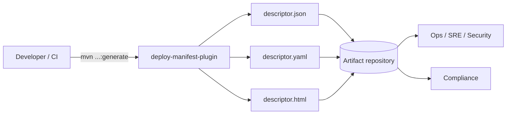

# Maven Deploy Manifest Plugin — Complete Guide

> Stop shipping black boxes. Generate a single source of truth about what you build, package, and deploy — automatically.

This guide explains how to install, run, and get the most out of `io.github.tourem:deploy-manifest-plugin`. You’ll see all features, configuration options, and copy‑paste recipes for JSON/YAML/HTML output, with screenshots.

---
## Table of Contents
- [Why use this plugin?](#why-use-this-plugin)
- [Quick start](#quick-start)
- [How it works (architecture)](#how-it-works-architecture)
- [HTML report overview](#html-report-overview)
- [Feature tour](#feature-tour)
  - [1) Build Info (always on)](#1-build-info-always-on)
  - [2) Modules + executable detection](#2-modules--executable-detection)
  - [3) Dependency tree (optional)](#3-dependency-tree-optional)
  - [4) Licenses & compliance (optional)](#4-licenses--compliance-optional)
  - [5) Properties (optional)](#5-properties-optional)
  - [6) Plugins (optional)](#6-plugins-optional)
- [Copy-paste recipes](#copy-paste-recipes)
- [Configuration reference](#configuration-reference)
- [CI/CD examples](#cicd-examples)
- [Troubleshooting](#troubleshooting) · [FAQ](#faq) · [Support](#support)


## Why use this plugin?
- One command produces complete deployment metadata (Git, CI/CD, modules, containers, dependencies, properties, plugins, profiles)
- Outputs for both machines and humans: JSON/YAML for automation + a readable HTML report
- Traceability and compliance: licenses, properties, plugins, and dependency tree (opt‑in)

---

## Quick start

Run without modifying the POM:

```bash
mvn io.github.tourem:deploy-manifest-plugin:2.3.1:generate -Ddescriptor.generateHtml=true
```

POM configuration for reproducible builds:

```xml
<build>
  <plugins>
    <plugin>
      <groupId>io.github.tourem</groupId>
      <artifactId>deploy-manifest-plugin</artifactId>
      <version>2.3.1</version>
      <executions>
        <execution>
          <id>generate-deploy-manifest</id>
          <phase>package</phase>
          <goals><goal>generate</goal></goals>
        </execution>
      </executions>
    </plugin>
  </plugins>
</build>
```

Files are written at project root (or under `target/` if configured): `descriptor.json` and optionally `descriptor.yaml` / `descriptor.html` / archive.

---

## How it works (architecture)



---

## HTML report overview

- Dashboard: project summary, totals, quick badges
- Build Info tab: Git, CI/CD, Maven runtime, goals, Properties (with search), Profiles, and Build Plugins
- Modules tab: per‑module metadata (packaging, Java version, main class)
- Dependencies tab (optional): Flat/Tree views, highlight with Prev/Next, quick filters, scope badges
- Environments & Assemblies tabs: when present in the project

Screenshots:


---

## Feature tour

### 1) Build Info (always on)
- Git: SHA (short/long), branch, tag, dirty state, remote URL, message, author, date
- CI/CD: provider, build id/URL (auto‑detects GitHub Actions, GitLab CI, Jenkins, etc.)
- Maven: runtime version and home; executed goals and default goal
- Properties: Project / Maven / Custom / System / Environment groups with masking and search
- Profiles: default, active, available
- Build Plugins (optional): see “Plugins” section

### 2) Modules + executable detection
- Lists all modules; highlights deployable modules (JAR/WAR and Spring Boot)
- Java version, finalName, main class when detected
- Container images: detects Jib, Spring Boot build‑image, Fabric8, Quarkus, Micronaut, JKube

### 3) Dependency tree (optional)
- Summary + Flat/Tree views; CSV export from HTML; duplicate detection
- Hierarchical search with highlight and navigation; quick filters by known families

### 4) Licenses & compliance (optional)
- Reads dependency POM licenses for direct and transitive dependencies
- Configurable incompatible list (default: GPL‑3.0, AGPL‑3.0, SSPL)
- Compliance view (HTML) with pie chart and alert badges

### 5) Properties (optional)
- Full build context: project, maven, custom, system, environment
- Filter/mask sensitive keys (password, secret, token, apikey, credentials, auth, key)

### 6) Plugins (optional)
- Effective build plugins: coordinates, version (badge “outdated → latest” if enabled), phase, goals, source (pom/profile/parent; inherited)
- Sanitized configuration excerpts (sensitive key masking)
- Plugin Management table: managed plugins with version and “Used in Build” indicator
- Optional update checks (Maven Central, best‑effort, configurable timeout)

---

## Copy-paste recipes

Minimal JSON:
```bash
mvn io.github.tourem:deploy-manifest-plugin:2.3.1:generate
```

JSON + YAML + HTML:
```bash
mvn io.github.tourem:deploy-manifest-plugin:2.3.1:generate -Ddescriptor.exportFormat=both -Ddescriptor.generateHtml=true
```

Dependency tree (Tree+Flat) with compile+runtime scopes:
```bash
mvn io.github.tourem:deploy-manifest-plugin:2.3.1:generate -Ddescriptor.includeDependencyTree=true -Ddescriptor.dependencyTreeFormat=both -Ddescriptor.dependencyScopes=compile,runtime
```

Licenses with warnings and custom incompatible list:
```bash
mvn io.github.tourem:deploy-manifest-plugin:2.3.1:generate -Ddescriptor.licenseWarnings=true -Ddescriptor.incompatibleLicenses=GPL-3.0,AGPL-3.0,SSPL
```

Properties including environment variables:
```bash
mvn io.github.tourem:deploy-manifest-plugin:2.3.1:generate -Ddescriptor.includeProperties=true -Ddescriptor.includeEnvironmentVariables=true
```

Plugins with configuration and update checks:
```bash
mvn io.github.tourem:deploy-manifest-plugin:2.3.1:generate -Ddescriptor.includePlugins=true -Ddescriptor.includePluginConfiguration=true -Ddescriptor.checkPluginUpdates=true -Ddescriptor.generateHtml=true
```

Combine everything:
```bash
mvn io.github.tourem:deploy-manifest-plugin:2.3.1:generate \
  -Ddescriptor.exportFormat=both -Ddescriptor.generateHtml=true \
  -Ddescriptor.includeDependencyTree=true -Ddescriptor.dependencyTreeFormat=both \
  -Ddescriptor.includeLicenses=true -Ddescriptor.licenseWarnings=true \
  -Ddescriptor.includeProperties=true -Ddescriptor.includeEnvironmentVariables=true \
  -Ddescriptor.includePlugins=true -Ddescriptor.checkPluginUpdates=true
```

POM configuration (common excerpt):
```xml
<plugin>
  <groupId>io.github.tourem</groupId>
  <artifactId>deploy-manifest-plugin</artifactId>
  <version>2.3.1</version>
  <configuration>
    <exportFormat>both</exportFormat>
    <generateHtml>true</generateHtml>
    <includeDependencyTree>true</includeDependencyTree>
    <dependencyTreeFormat>both</dependencyTreeFormat>
    <includeLicenses>true</includeLicenses>
    <licenseWarnings>true</licenseWarnings>
    <includeProperties>true</includeProperties>
    <includeEnvironmentVariables>false</includeEnvironmentVariables>
    <includePlugins>true</includePlugins>
    <checkPluginUpdates>false</checkPluginUpdates>
  </configuration>
  <executions>
    <execution>
      <id>generate-deploy-manifest</id>
      <phase>package</phase>
      <goals><goal>generate</goal></goals>
    </execution>
  </executions>
</plugin>
```

---

## Configuration reference

Basics:

| Parameter | System Property | Default | Description |
|---|---|---|---|
| outputFile | descriptor.outputFile | descriptor.json | Output JSON filename |
| outputDirectory | descriptor.outputDirectory | ${project.build.directory} | Output directory |
| prettyPrint | descriptor.prettyPrint | true | JSON indentation |
| skip | descriptor.skip | false | Skip plugin |
| format | descriptor.format | none | Archive: zip, tar.gz, tar.bz2, jar |
| classifier | descriptor.classifier | descriptor | Attached classifier |
| attach | descriptor.attach | false | Attach artifact to project |
| exportFormat | descriptor.exportFormat | json | json, yaml, both |
| validate | descriptor.validate | false | Validate descriptor |
| sign | descriptor.sign | false | Generate SHA-256 signature |
| compress | descriptor.compress | false | Also write .json.gz |
| webhookUrl | descriptor.webhookUrl | — | POST descriptor on success |
| webhookToken | descriptor.webhookToken | — | Bearer token header |
| webhookTimeout | descriptor.webhookTimeout | 10 | Timeout (seconds) |
| summary | descriptor.summary | false | Console dashboard (dry-run) |
| generateHtml | descriptor.generateHtml | false | Generate HTML report |
| postGenerationHook | descriptor.postGenerationHook | — | Execute local command/script |

Dependency Tree:

| Parameter | System Property | Default | Description |
|---|---|---|---|
| includeDependencyTree | descriptor.includeDependencyTree | false | Enable dependency tree |
| dependencyTreeDepth | descriptor.dependencyTreeDepth | -1 | -1=unlimited, 0=direct |
| dependencyScopes | descriptor.dependencyScopes | compile,runtime | Scopes to include |
| dependencyTreeFormat | descriptor.dependencyTreeFormat | flat | flat, tree, both |
| excludeTransitive | descriptor.excludeTransitive | false | Drop transitives entirely |
| includeOptional | descriptor.includeOptional | false | Include optional dependencies |

Licenses:

| Parameter | System Property | Default |
|---|---|---|
| includeLicenses | descriptor.includeLicenses | false |
| licenseWarnings | descriptor.licenseWarnings | false |
| incompatibleLicenses | descriptor.incompatibleLicenses | GPL-3.0,AGPL-3.0,SSPL |
| includeTransitiveLicenses | descriptor.includeTransitiveLicenses | true |

Build Properties:

| Parameter | System Property | Default |
|---|---|---|
| includeProperties | descriptor.includeProperties | false |
| includeSystemProperties | descriptor.includeSystemProperties | true |
| includeEnvironmentVariables | descriptor.includeEnvironmentVariables | false |
| filterSensitiveProperties | descriptor.filterSensitiveProperties | true |
| maskSensitiveValues | descriptor.maskSensitiveValues | true |
| propertyExclusions | descriptor.propertyExclusions | password,secret,token,apikey,api-key,api_key,credentials,auth,key |

Plugins:

| Parameter | System Property | Default |
|---|---|---|
| includePlugins | descriptor.includePlugins | false |
| includePluginConfiguration | descriptor.includePluginConfiguration | true |
| includePluginManagement | descriptor.includePluginManagement | true |
| checkPluginUpdates | descriptor.checkPluginUpdates | false |
| filterSensitivePluginConfig | descriptor.filterSensitivePluginConfig | true |
| pluginUpdateTimeoutMillis | descriptor.pluginUpdateTimeoutMillis | 2000 |

---

## CI/CD examples

GitHub Actions (excerpt):
```yaml
- name: Generate Deploy Manifest
  run: mvn -B io.github.tourem:deploy-manifest-plugin:2.3.1:generate -Ddescriptor.exportFormat=both -Ddescriptor.generateHtml=true
- name: Upload artifacts
  uses: actions/upload-artifact@v4
  with:
    name: deploy-manifest
    path: |
      descriptor.json
      descriptor.yaml
      descriptor.html
```

---

## Troubleshooting
- Plugin not found: run `mvn clean install` locally or verify publication to Maven Central
- Empty Dependencies tab: enable `-Ddescriptor.includeDependencyTree=true`
- Missing environment variables: add `-Ddescriptor.includeEnvironmentVariables=true` and verify masking
- Slow update checks: tune `-Ddescriptor.pluginUpdateTimeoutMillis`

---

## FAQ
- Are sensitive data stored? By default, sensitive keys are filtered and masked (properties, plugin configs). Review masking before sharing.
- CI friendly? Yes. The plugin is read‑only and writes files/artifacts; network calls are optional (webhook, version checks).

---

## Support
Open an issue or PR on the repository. Contributions welcome!

